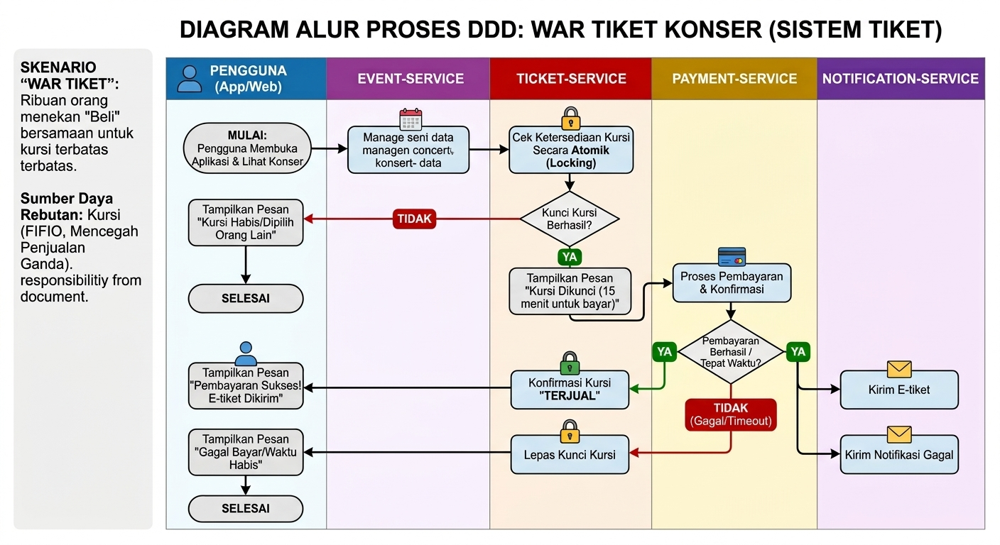

# Sistem War Tiket Konser
## Diagram Arsitektur



## Deskripsi Sistem

Sistem War Tiket Konser merupakan aplikasi berbasis microservices yang digunakan untuk melakukan pembelian tiket konser secara online. Sistem dirancang agar mampu menangani jumlah pengguna besar pada saat penjualan tiket berlangsung.

Arsitektur sistem dibagi menjadi beberapa layanan yang memiliki tanggung jawab masing-masing sehingga setiap layanan dapat dikembangkan dan diskalakan secara independen.

---

# Arsitektur Microservices

Sistem terdiri dari empat bounded context:

## 1. event-service

Bertanggung jawab mengelola data konser.

Data yang dikelola:
- Nama konser
- Jadwal konser
- Lokasi konser
- Informasi event


## 2. ticket-service

Bertanggung jawab mengelola tiket konser.

Data yang dikelola:
- Informasi tiket
- Nomor kursi
- Harga tiket
- Status ketersediaan tiket

Resource rebutan:
- Kursi tiket konser


## 3. payment-service

Bertanggung jawab menangani proses pembayaran.

Data yang dikelola:
- Transaksi pembayaran
- Status pembayaran
- Total pembayaran


## 4. notification-service

Bertanggung jawab mengirim notifikasi kepada pengguna.

Data yang dikelola:
- Pesan notifikasi
- Status pengiriman


---

# Context Map

```mermaid
flowchart TD

A[Mobile Application]

B[API Gateway :8080]

C[event-service]

D[ticket-service]

E[payment-service]

F[notification-service]


A --> B

B --> C
B --> D

D --> E

E --> F